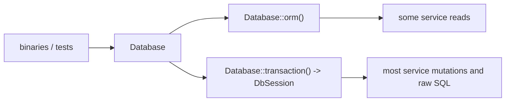
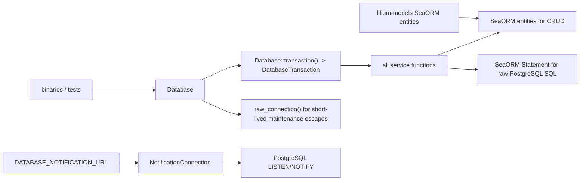

# Database Context Unification Implementation Plan

> **For agentic workers:** REQUIRED SUB-SKILL: Use superpowers:subagent-driven-development (recommended) or superpowers:executing-plans to implement this plan task-by-task. Steps use checkbox (`- [ ]`) syntax for tracking.

**Goal:** Replace the service-layer split between `Database::orm()` and raw `DbSession` with one SeaORM transaction/connection context for all ordinary database work.

**Architecture:** `lilium-database::Database` owns the ordinary application pool and exposes one transaction API whose callback receives a SeaORM `DatabaseTransaction`. Service functions accept `impl ConnectionTrait` / `&DatabaseTransaction`, use SeaORM entities for simple CRUD, and use SeaORM `Statement` / `FromQueryResult` for PostgreSQL-specific raw SQL. `raw_connection()` remains only for short-lived maintenance escapes outside service functions. PostgreSQL `LISTEN/NOTIFY` uses a dedicated direct `NotificationConnection` configured from `DATABASE_NOTIFICATION_URL`; it never uses ORM, transactions, `raw_connection()`, or the ordinary application pool. Table-shaped models have one source of truth in `lilium-models` as SeaORM entities; `lilium-database` owns runtime and transaction infrastructure, not table model definitions.

**Tech Stack:** Rust 2024, SeaORM 1.1, SQLx-backed PostgreSQL pool, existing `lilium-database` entities, existing DB-backed fixture profiles.

---

## Architecture Map

Current:



Target:



## Final API

`crates/lilium-database/src/lib.rs` exports:

```rust
pub use sea_orm::{
    ActiveModelTrait, ColumnTrait, ConnectionTrait, DatabaseTransaction, EntityTrait,
    FromQueryResult, QueryFilter, QueryOrder, QuerySelect, Set, Statement, TransactionTrait,
};

pub type DbTransaction = DatabaseTransaction;
```

`crates/lilium-database/src/database.rs` keeps `Database::orm()` private to `lilium-database` tests and migration internals, and service/binary code uses:

```rust
pub async fn transaction<T, F>(&self, f: F) -> Result<T>
where
    T: Send,
    F: for<'a> FnOnce(&'a DbTransaction) -> TransactionFuture<'a, T> + Send;
```

`crates/lilium-database/src/transaction.rs` defines:

```rust
use anyhow::Result;
use std::future::Future;
use std::pin::Pin;

pub type TransactionFuture<'a, T> = Pin<Box<dyn Future<Output = Result<T>> + Send + 'a>>;

#[macro_export]
macro_rules! transaction {
    ($database:expr, |$tx:pat_param| $body:block $(,)?) => {{
        $database.transaction(|$tx| Box::pin(async move $body))
    }};
}
```

No service function should accept `&mut DbSession` after this refactor.

Model boundary:

- Table row models are defined once in their existing `lilium-models` model modules, not in a parallel `entities` directory.
- Existing public names such as `lilium_models::dzmm::user::User` are type aliases of the corresponding SeaORM `Model` in the same module, not duplicate structs.
- Table-specific constructors such as `User::from_api` and `Message::from_websocket` live in `lilium-models` on the single table model type.
- Non-table shapes remain separate DTOs with explicit names: event envelopes, enriched search rows, stats rows, and other query projections.
- `lilium-database` does not define or re-export table models.

Notification listening is a separate runtime path:

```rust
#[derive(Debug, Clone)]
pub struct NotificationDatabaseConfig {
    pub url: String,
}

pub struct NotificationConnection;

impl NotificationConnection {
    pub async fn connect(config: NotificationDatabaseConfig) -> Result<Self>;
}
```

Binaries load `NotificationDatabaseConfig` from `DATABASE_NOTIFICATION_URL`, falling back to `DATABASE_URL`. Test configuration loads `TEST_DATABASE_NOTIFICATION_URL`, falling back to `TEST_DATABASE_URL`. `NotificationConnection::connect` opens a dedicated direct `sqlx::postgres::PgListener` for the listener lifecycle. Polling callbacks and notification handlers that read application tables use `Database::transaction()` separately.

## Task 1: Database Runtime Boundary

**Files:**
- Modify: `crates/lilium-database/src/database.rs`
- Modify: `crates/lilium-database/src/transaction.rs`
- Modify: `crates/lilium-database/src/lib.rs`
- Modify: `crates/lilium-database/src/pool.rs`
- Modify: `docs/database-layer-plan.md`

- [ ] Replace the callback transaction implementation so it starts a SeaORM transaction from `self.orm` and passes `&DbTransaction`.

Use this shape:

```rust
use sea_orm::{TransactionError, TransactionTrait};

pub async fn transaction<T, F>(&self, f: F) -> Result<T>
where
    T: Send,
    F: for<'a> FnOnce(&'a DbTransaction) -> TransactionFuture<'a, T> + Send,
{
    self.orm
        .transaction(|tx| f(tx))
        .await
        .map_err(|error| match error {
            TransactionError::Connection(error) => anyhow::Error::new(error),
            TransactionError::Transaction(error) => error,
        })
}
```

- [ ] Keep `raw_connection()` as the explicit short-lived maintenance escape hatch and do not route services through it.
- [ ] Stop exporting `DbSession` from `lib.rs` once all call sites are converted.
- [ ] Update `docs/database-layer-plan.md` so the service boundary says SeaORM `ConnectionTrait` / `DatabaseTransaction`, not `DbSession`.
- [ ] Run `cargo check -p lilium-database --all-targets`.

## Task 2: Account And Outgoing Command Services

**Files:**
- Modify: `crates/lilium-services/src/account.rs`
- Modify: `crates/lilium-services/src/outgoing_command.rs`
- Modify only tests in the same two files

- [ ] Change public service functions from `session: &mut DbSession` to `db: &C where C: ConnectionTrait`.
- [ ] Use `lilium_models::dzmm::account` and `lilium_models::dzmm::outgoing_command` active models for inserts and simple updates.
- [ ] Keep behavior checks unchanged: duplicate account rejection, credential validation, active websocket connection protection, rate-limit retry expansion, terminal status pruning.
- [ ] Implement count/existence checks through entity filters.
- [ ] Update tests so `transaction!(test_db.database(), |tx| { service_call(tx).await })` passes `tx`.
- [ ] Run `cargo test -p lilium-services account outgoing_command -- --test-threads=1`.

## Task 3: Room Member And Event Services

**Files:**
- Modify: `crates/lilium-services/src/room_member.rs`
- Modify: `crates/lilium-services/src/event.rs`
- Modify only tests in the same two files

- [ ] Convert `room_member.rs` to `ConnectionTrait` and the `room_members` entity.
- [ ] Preserve `upsert_member` semantics exactly: insert active row, conflict update resets `left_at = NULL`, updates `role`, `joined_at`, and `updated_at`.
- [ ] Convert simple event operations to entities: single insert, delete, queue depth, max id, latest cursor, processor offset get/update/delete.
- [ ] Keep dynamic event range scans as SeaORM raw statements executed through the same `ConnectionTrait`.
- [ ] Add small `FromQueryResult` row structs only inside `event.rs` for scalar raw result rows.
- [ ] Run `cargo test -p lilium-services room_member event -- --test-threads=1`.

## Task 4: User And Media Services

**Files:**
- Modify: `crates/lilium-services/src/user.rs`
- Modify: `crates/lilium-services/src/media.rs`
- Modify only tests in the same two files

- [ ] Remove `get_by_ids_raw`; all user primary-key reads use the existing ORM path.
- [ ] Change mutations and searches to accept the unified DB context.
- [ ] Convert simple user counters and avatar-file updates to entity updates.
- [ ] Keep `search_users`, `upsert_user`, and `save_user_history` as SeaORM raw statements because they use `tsquery`, `ON CONFLICT ... COALESCE`, and the currently unmodeled `user_history` table.
- [ ] Convert `collect_message_media_downloads` and simple `messages.attachment_file` updates through `messages` entity where possible.
- [ ] Keep `image_gps` inserts as SeaORM raw statements until `image_gps` has an entity.
- [ ] Run `cargo test -p lilium-services user media -- --test-threads=1`.

## Task 5: Message Service

**Files:**
- Modify: `crates/lilium-services/src/message.rs`
- Modify only tests in the same file

- [ ] Change all function signatures from `&mut DbSession` to the unified DB context.
- [ ] Convert simple message operations to `messages` entity calls: existence, create one, mark deleted, mark recalled, latest/earliest timestamp.
- [ ] Keep dynamic search, cursor pagination, enrichment joins, full-text search, and batch multi-row insert as SeaORM raw statements.
- [ ] Add local `FromQueryResult` implementations or small row structs for `EnrichedMessage`, `MessageStats`, and tuple replacements where raw statements remain.
- [ ] Preserve cursor behavior and ordering tests.
- [ ] Run `cargo test -p lilium-services message -- --test-threads=1`.

## Task 6: Notification Dedicated Connection Boundary

**Files:**
- Modify: `crates/lilium-database/src/database.rs`
- Modify: `crates/lilium-database/src/lib.rs`
- Modify: `crates/lilium-services/src/notification.rs`
- Modify: `binaries/lilium-event-processor/src/config.rs`
- Modify: `binaries/lilium-spider/src/config.rs`
- Modify only notification tests and config tests in the same files

- [ ] Add `NotificationDatabaseConfig` and `NotificationConnection`.
- [ ] Implement `NotificationConnection::connect` with one dedicated `sqlx::postgres::PgListener`.
- [ ] Export `NotificationDatabaseConfig` and `NotificationConnection` from `lilium_database`.
- [ ] Load `DATABASE_NOTIFICATION_URL` with fallback to `DATABASE_URL` in production binary config.
- [ ] Load `TEST_DATABASE_NOTIFICATION_URL` with fallback to `TEST_DATABASE_URL` in DB-backed test config.
- [ ] Keep `NotificationService` subscriber state separate from ordinary service DB transactions.
- [ ] Run `cargo test -p lilium-database notification -- --include-ignored`.
- [ ] Run `cargo test -p lilium-services notification`.

## Task 7: Test Fixture Boundary

**Files:**
- Modify: `crates/lilium-test-fixtures/src/database.rs`
- Modify: `crates/lilium-test-fixtures/src/profile.rs`
- Modify: `crates/lilium-test-fixtures/src/reset.rs`
- Modify: `crates/lilium-test-fixtures/src/seeds.rs`
- Modify only tests in `crates/lilium-test-fixtures`

- [ ] Remove imports of `DbSession`.
- [ ] Change reset and seed helpers to accept `&impl ConnectionTrait`.
- [ ] Execute raw reset/partition SQL through SeaORM `Statement` on the provided connection.
- [ ] Execute fixture seed inserts through SeaORM entities for modeled tables.
- [ ] Keep fixture acquisition boundaries unchanged: one leased database per active test unit, reset before handoff, reset again on next acquire.
- [ ] Run `cargo test -p lilium-test-fixtures`.

## Task 8: Binary Call-Site Cleanup

**Files:**
- Modify: `binaries/lilium-event-processor/src/processor.rs`
- Modify: `binaries/lilium-spider/src/worker/mod.rs`
- Modify: `binaries/lilium-spider/src/arbiter/mod.rs`
- Modify: `binaries/lilium-spider/src/ingestion.rs`

- [ ] Remove imports of `DbSession`.
- [ ] Update helper function signatures to accept `&DbTransaction` or `&impl ConnectionTrait`.
- [ ] Keep transaction scoping unchanged: each current `transaction!(database, |session| { ... })` remains one transaction, but the variable should be named `tx`.
- [ ] Run `cargo test -p lilium-event-processor` and `cargo test -p lilium-spider`.

## Task 9: Single Model Source Cleanup

**Files:**
- Modify: `crates/lilium-database/Cargo.toml`
- Modify: `crates/lilium-database/src/lib.rs`
- Modify: `crates/lilium-models/Cargo.toml`
- Modify: `crates/lilium-models/src/dzmm/*.rs`
- Modify: `crates/lilium-models/src/ingestion/mod.rs`
- Modify: `crates/lilium-models/src/wallet/mod.rs`
- Delete: `crates/lilium-database/src/entities`
- Modify service and binary files that import `lilium_database::entities` or `lilium_models::entities`

- [ ] Merge SeaORM metadata into the existing `lilium-models` model modules.
- [ ] Add the SeaORM dependency to `lilium-models`.
- [ ] Rename each table-row struct to SeaORM's required `Model` in its existing module and keep the business type name as a type alias.
- [ ] Move table constructors and helpers onto the single model type in `lilium-models`.
- [ ] Remove `sqlx::FromRow` derives and imports from table models.
- [ ] Remove the `sqlx` dependency from `lilium-models` once raw SQL query rows use SeaORM `FromQueryResult`.
- [ ] Update services and binaries to import table modules from `lilium_models::dzmm` and `lilium_models::ingestion`.
- [ ] Keep local `FromQueryResult` structs only for non-table raw SQL projections.
- [ ] Run `cargo check -p lilium-models`.
- [ ] Run `cargo check -p lilium-database --all-targets`.
- [ ] Run `cargo check -p lilium-services --all-targets`.

## Task 10: Final Verification

**Files:**
- No planned source edits unless verification finds compile fallout.

- [ ] Run `rg -n "DbSession|\\.orm\\(|Database::orm|use sqlx::query|sqlx::query" crates/lilium-services binaries -g '*.rs'`.
- [ ] Confirm any remaining `sqlx::query` in services/binaries is a SeaORM `Statement` replacement target, a short-lived maintenance escape, or the dedicated notification listener path.
- [ ] Run `rg -n "pub mod entities|lilium_(database|models)::entities|lilium_database::entities" crates binaries -S` and confirm no entity namespace remains.
- [ ] Run `rg -n "pub struct Model|DeriveEntityModel" crates/lilium-database/src crates/lilium-models/src -S` and confirm table entity metadata lives only in `lilium-models`.
- [ ] Run `rg -n "FromRow|sqlx" crates/lilium-models crates/lilium-database/Cargo.toml -S` and confirm no SQLx row mapping remains in table models.
- [ ] Run `cargo fmt --all --check`.
- [ ] Run `cargo test -p lilium-database --all-targets`.
- [ ] Run `cargo test -p lilium-services -- --test-threads=1`.
- [ ] Run `cargo test -p lilium-event-processor`.
- [ ] Run `cargo test -p lilium-spider`.

## Worker Allocation

Use `gpt-5.4-mini` workers with disjoint write ownership:

1. Worker A owns Task 1.
2. Worker B owns Task 2.
3. Worker C owns Task 3.
4. Worker D owns Task 4.
5. Worker E owns Task 5.
6. Worker F owns Task 6.
7. Worker G owns Task 7.
8. Worker H owns Task 8 after service and fixture workers report completion.
9. Worker I owns Task 9 after service, fixture, and binary workers report completion.

Workers are not alone in the codebase. They must not revert edits outside their ownership, and they must report changed paths and validation results.
